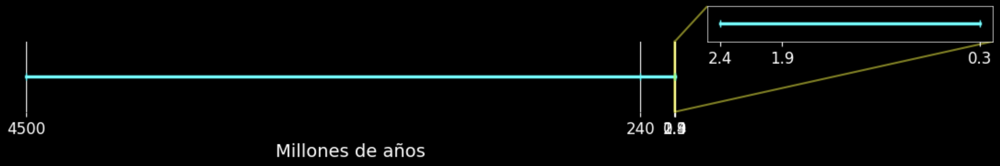
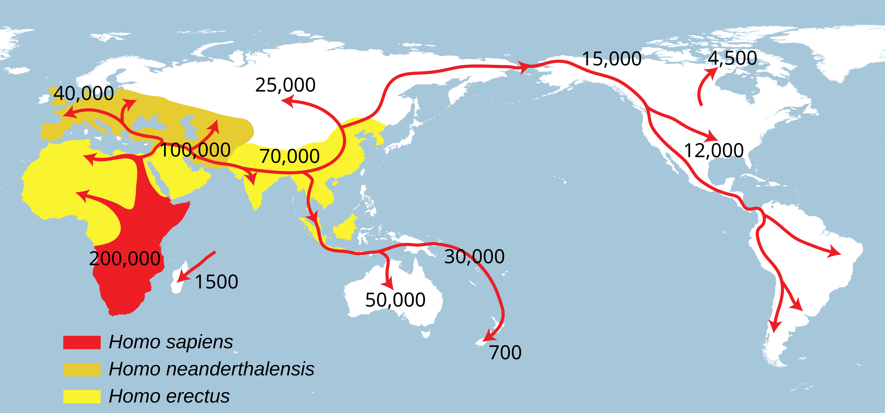
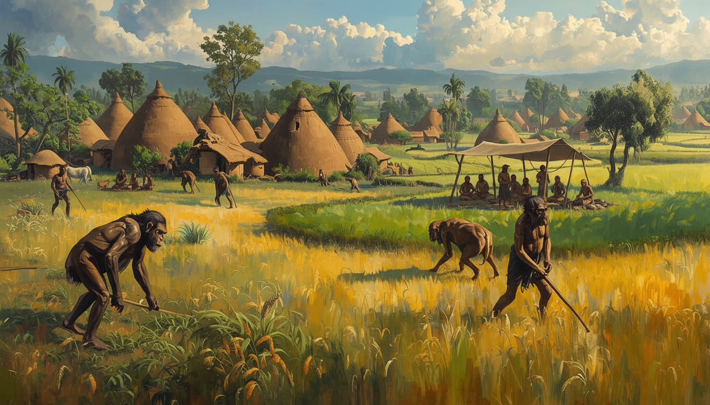
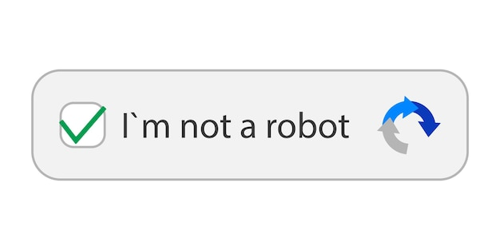
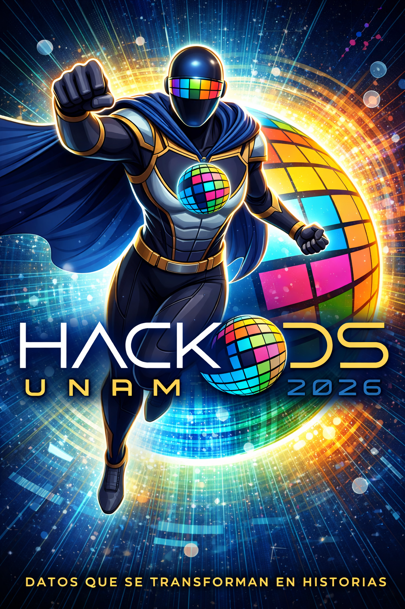

```{python}
#| include: false
import numpy as np
from scipy.interpolate import CubicSpline
import plotly.graph_objects as go

# ── Curva ──────────────────────────────────────────────────────────────────────
x_ctrl = np.array([0.0, 0.30, 0.50, 0.72, 1.0])
y_ctrl = np.array([0.0, 0.50, 1.00, 0.55, 0.05])
cs = CubicSpline(x_ctrl, y_ctrl)

x_curve = np.linspace(0, 1, 500)
y_curve = cs(x_curve)

n = len(x_curve)
seg1 = int(n * 0.50)
seg2 = n - seg1

colors_up = [
    f"rgb({int(120 + 135*i/seg1)},{int(20 + 40*i/seg1)},{int(220 - 80*i/seg1)})"
    for i in range(seg1)
]
colors_down = [
    f"rgb(255,{int(60 + 110*i/seg2)},{int(30*i/seg2)})"
    for i in range(seg2)
]

# ── Estrellas ──────────────────────────────────────────────────────────────────
rng = np.random.default_rng(42)
stars_x = rng.uniform(0, 1, 200)
stars_y = rng.uniform(0, 1.15, 200)
star_sizes = rng.uniform(1, 4, 200)

# ── Puntos narrativos ──────────────────────────────────────────────────────────
story_points = [
    dict(
        x=0.04, y=0.02,
        section="[I]  EXPOSICIÓN",
        title="La vida ordinaria",
        body="Carlos vive en la CDMX. Sube a su azotea a ver las estrellas, como siempre.",
        color="#00e5ff",
    ),
    dict(
        x=0.30, y=0.50,
        section="[II]  ACCIÓN ASCENDENTE",
        title="El conflicto escala",
        body="Una nave alienígena desciende y lo abducen. Nadie lo vio. Nadie lo cree… excepto Luma.",
        color="#b06aff",
    ),
    dict(
        x=0.50, y=1.00,
        section="[III]  CLÍMAX",
        title="La batalla final",
        body="Luma irrumpe en la nave a 400 km de altitud. Puñetazo a puñetazo contra tres xenomorfos.",
        color="#ff2d78",
    ),
    dict(
        x=0.72, y=0.55,
        section="[IV]  ACCIÓN DESCENDENTE",
        title="Las consecuencias",
        body="La nave huye averiada. Carlos, agotado, flota en brazos de Luma entre escombros estelares.",
        color="#ffa500",
    ),
    dict(
        x=0.965, y=0.055,
        section="[V]  DESENLACE",
        title="El nuevo equilibrio",
        body="Carlos vuelve a casa cambiado — no mira las estrellas con calma — las mira con gratitud.",
        color="#00e676",
    ),
]

# ── Construcción de la figura ──────────────────────────────────────────────────
fig = go.Figure()

# Zona de máxima tensión
fig.add_shape(
    type="rect",
    x0=0.38, x1=0.62, y0=-0.08, y1=1.18,
    fillcolor="rgba(80,0,120,0.35)",
    line=dict(width=0),
    layer="below",
)

# Estrellas
fig.add_trace(go.Scatter(
    x=stars_x, y=stars_y,
    mode="markers",
    marker=dict(size=star_sizes, color="white", opacity=0.6),
    hoverinfo="skip",
    showlegend=False,
))

# Curva degradada
for i in range(n - 1):
    col = colors_up[i] if i < seg1 else colors_down[i - seg1]
    fig.add_trace(go.Scatter(
        x=[x_curve[i], x_curve[i+1]],
        y=[y_curve[i], y_curve[i+1]],
        mode="lines",
        line=dict(color=col, width=4),
        hoverinfo="skip",
        showlegend=False,
    ))

# Puntos con tooltip
for pt in story_points:
    tooltip = (
        f"<b style='font-size:20px;color:{pt['color']}'>{pt['section']}</b><br>"
        f"<b style='font-size:18px;color:white'>{pt['title']}</b><br>"
        f"<span style='font-size:16px;color:#dddddd'>{pt['body']}</span>"
    )
    fig.add_trace(go.Scatter(
        x=[pt["x"]], y=[pt["y"]],
        mode="markers",
        marker=dict(size=18, color=pt["color"], line=dict(width=3, color="white")),
        hovertemplate=tooltip + "<extra></extra>",
        showlegend=False,
    ))
    # Halo
    fig.add_trace(go.Scatter(
        x=[pt["x"]], y=[pt["y"]],
        mode="markers",
        marker=dict(size=30, color="rgba(0,0,0,0)",
                    line=dict(width=2, color=pt["color"]), opacity=0.4),
        hoverinfo="skip",
        showlegend=False,
    ))

# Etiquetas de sección
section_labels = [
    dict(x=0.04,  y=0.10,  text="[I]",   color="#00e5ff"),
    dict(x=0.30,  y=0.60,  text="[II]",  color="#b06aff"),
    dict(x=0.50,  y=1.10,  text="[III]", color="#ff6fa3"),
    dict(x=0.72,  y=0.65,  text="[IV]",  color="#ffa500"),
    dict(x=0.965, y=0.14,  text="[V]",   color="#00e676"),
]
for lbl in section_labels:
    fig.add_annotation(
        x=lbl["x"], y=lbl["y"],
        text=f'<span style="font-family:monospace;font-size:14px;'
             f'color:{lbl["color"]};letter-spacing:1px">{lbl["text"]}</span>',
        showarrow=False, xanchor="center",
    )

fig.add_annotation(
    x=0.50, y=1.16,
    text='<span style="font-family:monospace;font-size:14px;color:#ff6fa3;'
         'letter-spacing:2px">ZONA DE MÁXIMA TENSIÓN</span>',
    showarrow=False, xanchor="center",
)

fig.add_annotation(
    x=1.0, y=-0.07,
    xref="paper", yref="paper",
    text='<span style="color:#333;font-size:9px">hackods.unam.mx</span>',
    showarrow=False, xanchor="right",
)

fig.update_layout(
    paper_bgcolor="#0a0a1a",
    plot_bgcolor="#0a0a1a",
    margin=dict(l=60, r=30, t=30, b=50),
    hoverlabel=dict(
        bgcolor="#12122a",
        bordercolor="#444",
        font=dict(family="sans-serif", size=13),
        namelength=0,
    ),
    hovermode="closest",
    xaxis=dict(
        showgrid=False, zeroline=False,
        range=[-0.02, 1.05],
        tickvals=[], ticktext=[],
        title=dict(text="TIEMPO  →",
                   font=dict(color="#aaaaaa", size=12, family="monospace")),
        showline=True, linecolor="#444", linewidth=1,
    ),
    yaxis=dict(
        showgrid=False, zeroline=False,
        range=[-0.08, 1.22],
        tickvals=[], ticktext=[],
        title=dict(text="TENSIÓN<br>DRAMÁTICA",
                   font=dict(color="#aaaaaa", size=11, family="monospace")),
        showline=True, linecolor="#444", linewidth=1,
    ),
    showlegend=False,
)
```

# Contenido 

<font style="font-size:60px;">

* Génesis.
* ¿Qué es storytelling?
* Storytelling para tableros.

</font>

# Génesis {background-color="black" background-image="./figures/fire.jpg" background-size="cover" background-opacity="0.95"}

## En el principio {background-color="black" background-image="./figures/fire.jpg" background-size="cover" background-opacity="0.25"}

::::{.incremental}
<font style="font-size:60px;">

* Hace 14 mil millones de años ...
* ... durante el *Big Bang* 
* Materia, energía, tiempo y espacio.

</font>
::::

. . .

:::{.r-stack}
<font color="DeepSkyBlue" style="font-size:80px;"> Física </font>
:::


## Enseguida {background-color="black" background-image="./figures/atoms_into.jpg" background-size="cover" background-opacity="0.25"}

::::{.incremental}
<font style="font-size:60px;">

* 300,000 años después ...
* Materia y energía se empiezan a fusionar ...
* Átomos $\rightarrow$ Moléculas

</font>
::::

. . .

:::{.r-stack}
<font color="Orange" style="font-size:80px;"> Química </font>
:::


## Y luego {background-color="black" background-image="./figures/In_a_planet_called_Earth.jpg" background-size="cover" background-opacity="0.25"}

::::{.incremental}
<font style="font-size:60px;">

* 4 mil millones de años atrás ...
* en un planeta llamado Tierra ...
* Las moléculas se combinaron para formar organismos.

</font>

::::

. . .

:::{.r-stack}
<font color="LimeGreen" style="font-size:80px;"> Biología </font>
:::


## No hace mucho {background-color="black" background-image="./figures/homo_sapiens_village.jpg" background-size="cover" background-opacity="0.25"}

::::{.incremental}

* <font style="font-size:60px;">70,000 años ...</font>
* <font style="font-size:50px;">Los organismos pertenecientes a las especies *Homo* (*habilis, erectus, neanderthalensis, floresiensis, sapiens*) formaron estructuras mucho más elaboradas llamadas
 **Culturas**.</font>
 
::::

. . .

:::{.r-stack}
<font color="Goldenrod" style="font-size:80px;"> Historia </font>
:::

## Regresemos un poco {background-color="black" background-image="./figures/Milky_Way.jpg" background-size="cover" background-opacity="0.25"}

. . .

<font style="font-size:50px;">
La tierra se formó hace  ~4,500 millones de años.
</font>

. . .

<font style="font-size:40px;">

|Especie|Aparición|Desaparición|
|:-------:|:---------:|:--------:|
|Dinosaurios|240|65|
|Homo habilis|2.4|1.4|
|Homo erectus|1.9|0.1|
|Homo sapiens|0.3| ¿?|

:::{.r-stack}
(Millones de años)
:::
</font>

. . .

{width="50%" fig-align="center" .lightbox}


## Revolución cognitiva ~ 70,000 años.

::: {layout-ncol=2 layout-valign="bottom"}

{width=100% .lightbox}

. Inicio del Storytelling (~30,000 años). Author: J Clottes. Copyright: © MCC/DRAC.](./figures/Homo_storytelling.jpg){width=80%}

:::


## Dos revoluciones más.

::: {.columns}
::: {.column .fragment}
Agrícola ~12,000 años.

{width="100%" .lightbox}
:::
::: {.column .fragment}
Científica ~500 años.

{width="100%" .lightbox}
:::
:::

## Años recientes. 

* Durante los últimos cien años el *homo sapiens* ha controlado: hambrunas, plagas, guerras. 
* Más gente muere por excesos que por escasez (p.ej. por edad avanzada que por enfermedades, por demasiada alimentación que por hambruna, por suicidio que por ...).
* El *homo sapiens* es la única especie que dominia y manipula el planeta entero (y sus alrededores).
* ¿Se puede imaginar un ser superior al *homo sapiens*?

## *Homo deus* {background-color="black" background-image="./figures/homodeus.png" background-size="cover" background-opacity="0.25"}

<br><br>

. . .

:::{.r-stack}
<font color="Khaki" style="font-size:60px;"> ¿Será que estamos  por terminar con la historia del *homo sapiens* y comenzar algo completamente diferente? </font>
:::

## ¿Que es lo humano hoy en día? {.scrollable}

. . .

::: {.columns}
::: {.column width="70%"}

> <font color="Khaki" style="font-size:40px;">*Somos la primera especie que debe demostrar a las máquinas que no es un robot*</font>, Juan Villoro.

:::
::: {.column width="30%"}

{width="100%"}

:::
:::

<font style="font-size:35px;">

::: {.incremental}
* Somos seres conscientes de nuestra propia existencia, de nuestros límites y con capacidad de reflexión sobre nuestros actos.

* Somos seres emocionales, sociales y culturales.

* Nos adaptamos a nuestro entorno. 

* El contacto humano se está perdiendo en la era digital (identidad).
:::

</font>


##  El efecto Flyn: debut y despedida.

::: {.incremental}

> * <font color="Khaki" style="font-size:35px;">James Flyn estudió la evolución de la inteligencia humana y se basó en tests del cociente intelectual (CI).</font>
* <font color="Khaki" style="font-size:35px;">El CI de la humanidad creció en 30 puntos en algunos países durante el siglo XX.</font>
* <font color="Khaki" style="font-size:35px;">***Efecto Flyn***: aumento sostenido de la inteligencia.</font>
* <font color="Khaki" style="font-size:35px;"> Flyn murió en diciembre de 2020, justo cuando se descubrió que la capacidad cognitiva estaba disminuyendo.</font>
:::

:::{.r-stack}
(Villoro, J., 2024)
:::

## ¿Por qué?

::: {.incremental}

> * <font color="Khaki" style="font-size:35px;">Ante la amenaza de un mamut, los antiguos homínidos se ponían de acuerdo, pues era un asunto de vida o muerte.</font>
* <font color="Khaki" style="font-size:35px;">Incrementaron la habilidad cognitiva por medio de la vida social.</font>
* <font color="Khaki" style="font-size:35px;">El ejercicio colectivo de la inteligencia depende de fraguar consensos y convencer al prójimo, [David Roboson](https://www.google.com.mx/books/edition/The_Intelligence_Trap/zyRmwgEACAAJ?hl=en).</font>
* <font color="Khaki" style="font-size:35px;">[Pablo Rudomín](https://es.wikipedia.org/wiki/Pablo_Rudom%C3%ADn) distingue entre inteligencia individual e inteligencia social; la segunda va en decaimiento.</font>
:::

:::{.r-stack}
(Villoro, J., 2024)
:::

## El fin de la inteligencia.

[El fin de la inteligencia: humanos con caducidad](https://www.gatopardo.com/articulos/el-fin-de-la-inteligencia-humanos-con-caducidad). Juan Villoro. Gato Pardo 24/20/2024.

. . .

>* <font color="Khaki" style="font-size:35px;">[Peter Dockrill](https://www.sciencealert.com/peter-dockrill): la humanidad alcanzó su pináculo intelectual a mediados de los años setenta [ScienceAlert](https://www.sciencealert.com/iq-scores-falling-in-worrying-reversal-20th-century-intelligence-boom-flynn-effect-intelligence).</font>
* <font color="Khaki" style="font-size:35px;">[David Robson](https://www.bbc.com/future/author/david-robson) : a partir de los 90 el CI desciende a un ritmo de 0.2 puntos al año en Finlandia, Noruega y Dinamarca [BBC Future](https://www.bbc.com/future/article/20190709-has-humanity-reached-peak-intelligence).</font>
* <font color="Khaki" style="font-size:35px;">[Will Conaway](): *La tecnología aumenta mientras el CI declina*, Forbes.</font>

## El fin de la inteligencia.
 
::: {.incremental}

> * <font color="Khaki" style="font-size:35px;">El panorama empeora al hacer otra comparación: el CI decae al tiempo que la inteligencia artificial mejora. </font>
* <font color="Khaki" style="font-size:35px;">[Geoffrey Hinton](https://en.wikipedia.org/wiki/Geoffrey_Hinton) dimitió de su cargo directivo en Google [...] puso en práctica una virtud humana cada vez más rara: el arrepentimiento. </font>

* <font style="font-size:35px;">[P(doom)](https://en.wikipedia.org/wiki/P(doom)): probabilidad de resultados existencialmente catastróficos como resultado de la inteligencia artificial.</font>

* <font style="font-size:35px;">[P(doom): la ecuación del apocalipsis digital](https://forbes.com.mx/pdoom-la-ecuacion-del-apocalipsis-digital/). Rubén Vázquez (2024). </font>
:::

## Política y ética.

. . .

> <font color="Khaki" style="font-size:35px;">*A la relación que mantienen los animales humanos, como tú y como yo, con los otros animales humanos, lo llamamos política. [...] al modo en que lo hacemos lo llamamos ética*.</font> David Pastor Vico.

. . .

> <font color="Khaki" style="font-size:35px;">*Toda la cultura proviene de un peculiar invento griego: la conversación [...] intercambiar palabras sin rumbo fijo, aceptar las curiosidades y opiniones del otro, aplazar las certezas, admitir las dudas*.</font> J. Borges de acuerdo con Juan Villoro.


## ¿Que podemos hacer?

. . .

:::{.r-stack}
<font style="font-size:36px;">
<font color="Violet">**S**</font>(pecific) <font color="Violet">**M**</font>(easurable) <font color="Violet">**A**</font>(chievable) <font color="Violet">**R**</font>(elevant/ealistic) <font color="Violet">**T**</font>(ime-bound)
</font>
:::

:::: {.columns}
::: {.column width="20%" .fragment}
{width="100%"}
:::
::: {.column width="80%" .fragment}

::: {.incremental}
<font style="font-size:37px;">

* Debemos conocer cómo estamos actualmente.
* Analizar la información con que contamos.
* Visualizar esa información.
* Contar historias que entienda [toda nuestra sociedad](https://countrymeters.info/es/World)

</font>

:::

:::
::::

. . .

:::{.r-stack}
<font color="Violet" style="font-size:70px;"> Storytelling </font>
:::


# ¿Qué es el Storytelling? 

## Storytelling (ChatGPT)

> <font color="Khaki" style="font-size:35px;">El storytelling es la técnica de contar historias con un propósito, generalmente para comunicar ideas, enseñar, persuadir o generar conexión emocional con una audiencia. No se trata solo de narrar algo, sino de estructurar un mensaje en forma de historia para que sea más memorable, comprensible y significativo. </font>

. . .

> <font color="Khaki" style="font-size:35px;">Una buena historia:</font> <font style="font-size:35px;">genera emociones, facilita la memoria, ayuda a dar sentido a la información, crea empatía con personajes o situaciones.</font>


## Storytelling with data.

. . .

El **storytelling es un diferenciador** y no solo un decorado sobre gráficas.

. . .

Puntos importantes:

* Dramatismo.
* Divulgación.
* Fuentes confiables.
* Visualizaciones efectivas.


## La pirámide de Freytag.

* Técnica desarrollada por el dramaturgo alemán Gustav Freytag en 1863.
* Es un modelo de estructura narrativa de cinco actos que organiza la tensión dramática. 
* Comúnmente utilizada para analizar tragedias clásicas y shakesperianas.
* Hoy en día se sigue usando en películas y obras de teatro.

## Partes de la pirámide.

<font style="font-size:30px;">

|   |   |
|---|:---|
|<font color="Khaki">**Exposición**</font> (Introducción) | Se presentan los personajes, el escenario y el conflicto central|
|<font color="Khaki">**Acción ascendente**</font> (Complicación)| La tensión aumenta a medida que el protagonista se enfrenta a complicaciones y obstáculos.|
|<font color="Khaki">**Clímax**</font> (Momento crucial)| El punto culminante y de mayor impacto emocional, a menudo un punto de no retorno para el protagonista.|
|<font color="Khaki">**Acción descendente**</font> (Disminuye la tensión)| Las consecuencias del clímax comienzan a desarrollarse.|
|<font color="Khaki">**Desenlace**</font> (Catástrofe/Resolución)| La resolución final del conflicto. En la tragedia clásica, suele ser la caída o muerte del protagonista. |

</font>

## {background-color="#0a0a1a"}

```{python}
#| fig-width: 12
#| fig-height: 6.5
fig.show()
```

# Storytelling para tableros.

## Filosofía de diseño narrativo

* El tablero **no es una colección de gráficas**, es una historia que el usuario *vive* mientras se desplaza en las diferentes secciones. 
* Cada sección corresponde a una etapa de la pirámide de Freytag, y la transición entre ellas debe sentirse como un giro emocional, no como un cambio de pestaña.

## Acto 1 — El Gancho.

**"¿Qué tiene que ver esto contigo?"**

> *Exposición con tensión inmediata*.

**Objetivo narrativo:** anclar el problema global en algo local e íntimo. 

* No empezar con *"el mundo enfrenta…"* sino con un dato que golpee: *"En tu colonia, 85% de los hogares…"*

## Acto 2 — La Escalada

**"¿Qué tan grave es?"**

> *Rising action: mostrar cómo empeora el asunto*.

**Objetivo narrativo:** construir tensión con datos dependientes del tiempo. 

* El público debe sentir que el tiempo se acaba.

## Acto 3 — El Clímax 

**"El momento de la verdad"**

> *La gráfica que cambia todo*.

**Objetivo narrativo:** una visualización que condensa la paradoja o la injusticia central. 

* Debe ser la imagen que el público recuerde al cerrar el tablero.

## Acto 4 — La Caída 

**"Pero no todo está perdido"**

> *Falling action: mostrar casos de éxito locales reales*.

**Objetivo narrativo:** romper el pesimismo con evidencia.

* No usar promesas institucionales, sino con datos, mostrar las acciones de comunidades que están haciendo el esfuerzo (y que probablemente van mejorando), además de mostrar *cómo*.

## Acto 5 — La Resolución 

**"Tú puedes ser parte del cambio"**

> *Llamado a la acción basado en datos*.

**Objetivo narrativo:** el tablero termina con una pregunta abierta, no con una conclusión cerrada. 

* El público debe sentir que tiene poder de actuar, que no es un espectador pasivo sino alguien cuyas decisiones o acciones importan.

## Comentarios adicionales.

* Lo anterior se basa en el diseño de videojuegos, donde la acción del jugador es fundamental: 
    - el jugador siente que sus elecciones tienen consecuencias reales dentro del mundo del juego. 
* Los mejores tableros de datos hacen lo mismo, convierten al público en protagonista, no solo en audiencia.

## Comentarios adicionales. 

* En el contexto del tablero de ODS, significa que al terminar de ver los datos, el usuario no piensa *"qué triste, qué problema tan grande"* y cierra la pestaña, sino que piensa *"yo puedo hacer algo al respecto"*.

* Es lo contrario de la parálisis por análisis (***doom scrolling***): cuando los datos son tan abrumadores que en lugar de motivar, paralizan.

## En resumen.

* Aplica la pirámide de Freytag (hasta donde sea posible).
* Termina con una pregunta abierta en lugar de una conclusión cerrada.
* Muestra casos donde comunidades pequeñas están logrando cambios reales.
* Trata de incluir una *calculadora de impacto* donde el usuario experimente con variables.
* Que el lenguaje diga "¿qué harías tú?" en lugar de "esto es lo que los gobiernos deben hacer".


## Notas sobre divulgación <font style="font-size:40px;">(de Régules, 2024)</font>

. . .

> * <font color="Khaki" style="font-size:35px;">Olson et al. sugieren que lo que más les interesa a la mayoría de los seres humanos es lo que les pasa a otros seres humanos.</font>
* <font color="Khaki" style="font-size:35px;">Una buena divulgación habla de gente e ilustra ideas a través de historias de gente.</font>
* <font color="Khaki" style="font-size:35px;">Idealmente, la divulgación se basa en técnicas de la escritura literaria.</font>
* <font color="Khaki" style="font-size:35px;">*creative nonfiction*: historias reales bien contadas.</font>
* <font color="Khaki" style="font-size:35px;">La divulgación no es ciencia.</font>

## Buena divulgación <font style="font-size:40px;">(de Régules, 2024)</font>

> * <font color="Khaki" style="font-size:35px;">Cuidan el estilo.</font>
* <font color="Khaki" style="font-size:35px;">Complementan los resultados científicos con anécdotas.</font>
* <font color="Khaki" style="font-size:35px;">Se organizan como argumento lógicos o bien como narraciones.</font>
* <font color="Khaki" style="font-size:35px;">Evitan acomplejar al lector esquivando discretamente el lenguaje técnico.</font>
* <font color="Khaki" style="font-size:35px;">No suenan a artículos científicos.</font>
* <font color="Khaki" style="font-size:35px;">Revelan una voz propia y original.</font>


##  Referencias.
<font style="font-size:30px;">

* Harari, Y. N. (2025). [Sapiens: A Brief History of Humankind.](https://www.google.com.mx/books/edition/Sapiens_Tenth_Anniversary_Edition/MosvEQAAQBAJ?hl=en&gbpv=0)[Tenth Anniversary Edition] United States: HarperCollins.

* Harari, Y. N. (2016). [Homo Deus: A Brief History of Tomorrow](https://www.google.com.mx/books/edition/Homo_Deus/dWYyCwAAQBAJ?hl=en&gbpv=0). United Kingdom: Random House.

* Villoro, J. (2024). [No soy un robot: La lectura y la sociedad digital](https://www.google.com.mx/books/edition/No_soy_un_robot/3bAAEQAAQBAJ?hl=en&gbpv=0). Spain: Editorial Anagrama.

* Pastor Vico, D. (2021). [Ética para desconfiados](https://www.google.com.mx/books/edition/%C3%89tica_para_desconfiados/yYtGEAAAQBAJ?hl=es-419&gbpv=0). México: Planeta México.

* Régules, S. d. (2024). [Y sin embargo te mueve: Deleitar, conmover y persuadir con la ciencia](https://www.google.com.mx/books/edition/Y_sin_embargo_te_mueve/uL3w0AEACAAJ?hl=en). Mexico: Libros Grano de Sal.


Todas las gráficas  fueron creadas con [Leonardo IA](https://leonardo.ai/), excepto las que tienen atribución.
</font>
